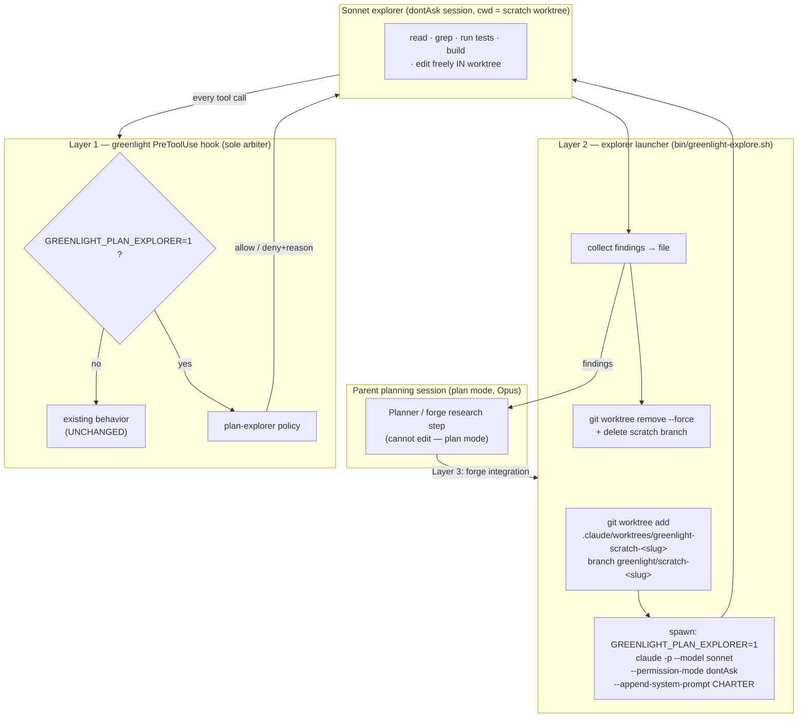
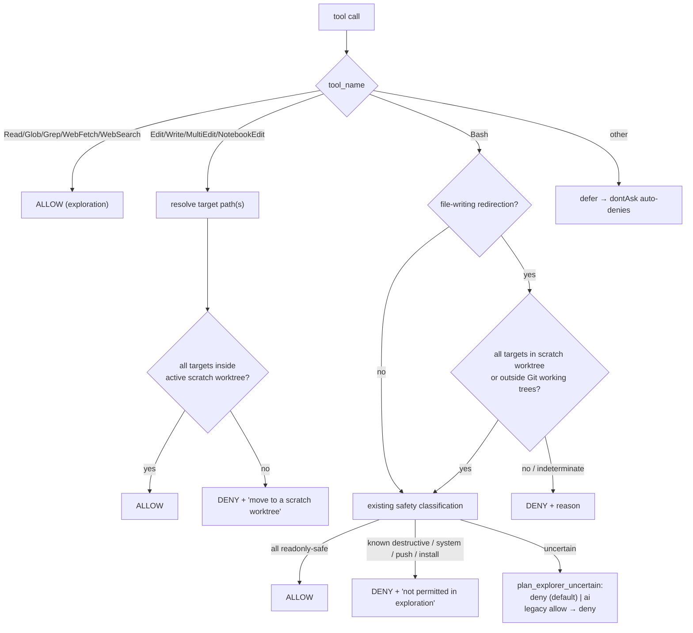

# SPEC — greenlight plan-explorer autonomy

Status: **DRAFT (awaiting approval)** · Target version: **v2.32.0** (minor) · Branch: `feat/greenlight-plan-explorer`

## 1. Motivation

Planning benefits from autonomous exploration, but Claude Code **plan mode is
intentionally hamstrung**: it hard-blocks every file edit (no hook can override
it) and prompts for permission on anything beyond the read-only command set. We
want plan-time *explorers* that:

- Explore a codebase autonomously — run safe commands without a human approving
  each one.
- Experiment with **real code changes** when that's the fastest way to learn —
  but only in a **disposable workspace** thrown away before the plan is written,
  never touching production code or tests on a real branch.
- Stay safe with **no human in the loop**: destructive/system operations and
  out-of-scope edits are hard-denied with corrective guidance, not silently
  deferred to a prompt that (headless) nobody answers.

## 2. Technical findings (empirically verified on Claude Code v2.1.214)

These shape the whole design and were confirmed by a live probe, not assumed:

1. **Plan mode blocks edits regardless of the hook.** A PreToolUse hook
   returning `permissionDecision:"allow"` for Edit/Write/MultiEdit/NotebookEdit
   in plan mode is *ignored* — the edit stays blocked. Hooks fire and may
   `deny`/`defer`, but cannot `allow` an edit through. → **Edit autonomy is
   impossible inside a plan-mode session.**
2. **`claude -p` subprocesses run their own session** with their own
   `--permission-mode`. In `dontAsk`, every call is auto-denied *unless* a
   PreToolUse hook returns `allow`. → **greenlight becomes the sole arbiter of a
   `dontAsk` explorer.**
3. **Env vars set on the `claude -p` invocation reach the hook.** Verified:
   `GREENLIGHT_PLAN_EXPLORER=1` and `GLTEST` were both visible to the hook
   process. Child sessions also natively expose `CLAUDE_CODE_CHILD_SESSION=1`,
   `CLAUDE_CODE_ENTRYPOINT=sdk-cli`, `CLAUDE_CODE_SESSION_ID`. → **explorer
   context is taggable and detectable.**
4. **Hook input carries what we need.** For v2.1.214 the PreToolUse stdin JSON
   has `cwd`, `permission_mode`, `tool_name`, `tool_use_id`, `session_id`,
   `transcript_path`, `effort`, `prompt_id`, and `tool_input` (with `file_path`
   for Edit/Write, `command` for Bash). No `is_subagent` field — context is
   inferred from env (finding 3).

The consequence: the user's "sonnet + `claude -p`" framing is not flavor, it is
**the only mechanism** that yields edit-capable autonomy from a planning
workflow. The parent stays in plan mode (Opus, cannot edit); it spawns Sonnet
`claude -p` explorers in `dontAsk`, and greenlight governs them.

## 3. Architecture

Three layers, each independently valuable:



### 3.1 Layer 1 — greenlight gate (the PreToolUse policy)

**Trigger.** The new policy is active **iff `GREENLIGHT_PLAN_EXPLORER=1`** is in
the hook's environment. Absent it, greenlight behaves *byte-for-byte as today*
(hard non-regression invariant, §6).

**Decision pipeline in explorer mode** (after the existing permission-mode gate;
note the explorer runs in `dontAsk`, which is not a disabled mode):



**Scratch-worktree detection** (the "may I edit here?" predicate):

- toplevel = `git -C <dir> rev-parse --show-toplevel`
- branch   = `git -C <dir> rev-parse --abbrev-ref HEAD`
- **is-scratch** ⇔ `branch` matches `${scratch_prefix}*` (default
  `greenlight/scratch-`) **AND** `toplevel` contains a `.claude/worktrees/`
  path segment. Requiring both makes accidental/spoofed matches unlikely.
- **target fitness**: resolve the edit target to a real absolute path
  (`realpath`, following symlinks and `..`); it is "inside scratch" ⇔ its
  realpath is under the scratch worktree's toplevel.

**Forbidden set (off scratch)** — matches the approved "any tracked-file edit"
choice, tightened to the preview's letter:

| Target location (off scratch) | Decision |
|---|---|
| Modify a git-tracked file in the repo tree | **DENY** |
| Create a new untracked file in the repo tree | **DENY** |
| Write under `/tmp` or the session scratch dir | ALLOW |
| Write to a path under no git working tree | ALLOW |
| Any write inside the active scratch worktree | ALLOW |

I.e. **off scratch the repo working tree is read-only**; writes are permitted
only to the scratch worktree or outside the repo entirely.

### 3.2 Layer 2 — explorer launcher

`plugins/greenlight/bin/greenlight-explore.sh` — verb-first CLI (repo
convention), with a `bin/greenlight-explore.bats` beside it.

- `greenlight-explore run --task "<question>" [--model M] [--repo PATH] [--name SLUG] [--keep] [--base REF]`
  1. resolve repo root (default: cwd's toplevel)
  2. `git worktree add <repo>/.claude/worktrees/greenlight-scratch-<slug> -b greenlight/scratch-<slug> <base|HEAD>`
  3. `GREENLIGHT_PLAN_EXPLORER=1 claude -p --model <model> --permission-mode dontAsk --append-system-prompt "<CHARTER>" "<task>"` with cwd = worktree; capture stdout to a findings file under the session scratch dir
  4. teardown (unless `--keep`): `git worktree remove --force` + `git branch -D greenlight/scratch-<slug>` — via an `EXIT` trap so a crash still cleans up
  5. print findings path + summary to stdout for the caller
- Defaults: model from `plan_explorer_model` (default `claude-sonnet-5`);
  `sonnet` alias acceptable.
- Guards: refuse if `git`/`claude` absent; refuse a dirty *worktree path*
  collision; never touch the caller's working tree (worktrees are isolated).

Skill route: `/greenlight explore <task>` in `SKILL.md` dispatches here.

**Explorer charter** (`--append-system-prompt`) aligns the model with the gate
so denials are rare:

> You are a plan-mode explorer working in a **disposable git worktree**. Any
> edits you make here are throwaway and will be discarded before the plan is
> written — so experiment freely *inside this directory* (read, grep, run
> tests, build, even change code to test a hypothesis). Never edit files
> outside this worktree and never run destructive or system-level commands;
> the greenlight safety gate will deny them. End with a structured findings
> report: what you learned, the evidence, and your recommendation.

### 3.3 Layer 3 — forge `research` integration

forge's **`research`** step gains an *optional* governed-explorer path: for
codebase-grounded questions that benefit from actually running code, it invokes
`greenlight-explore` instead of / alongside its current
investigator/domain-researcher agents, and folds the returned findings into its
research artifact. **Additive and behind a config/flag** — default forge
behavior is unchanged unless enabled. Because forge is heavily engineered, I'll
**re-confirm the exact integration before editing forge internals** (this is the
last wave).

## 4. Config additions (`references/default-config.yaml`)

```yaml
# Plan-explorer autonomy (only affects sessions tagged GREENLIGHT_PLAN_EXPLORER=1)
plan_explorer_enabled: true                 # master switch for the hook policy
plan_explorer_scratch_prefix: greenlight/scratch-
plan_explorer_uncertain: deny               # deny | ai; legacy allow denies
plan_explorer_model: claude-sonnet-5        # launcher default model
plan_explorer_worktree_segment: .claude/worktrees
```

## 5. Interfaces touched

### AGE-54: retirement of blanket uncertainty approval

`plan_explorer_uncertain: allow` is no longer supported. Uncertain commands
receive an explicit denial explaining the migration to `deny` or opted-in `ai`
(`ai_enabled: true` plus `ANTHROPIC_API_KEY`). Existing user configuration files
are not rewritten. Missing, empty and unrecognized values deny; deterministic
approvals, destructive denials, custom configuration precedence and normal
sessions retain their behavior. Claude approvals retain their existing envelope;
Codex safe results remain neutral, and both hosts receive explicit denials.

The uncertain bucket includes arbitrary unknown executables, so an exclusion
list of package runners would leave equivalent execution paths approved.
Worktrees separate working files; they do not contain processes, network access,
credentials or shared stores. AI evaluation and explicit custom approvals are
trust decisions, and the build/test allowlist is not an adversarial sandbox.

Redirection destination validation is necessary but does not authorize the
command producing output. After valid destinations, classification still checks
the command, later segments and substitutions before explorer policy decides.
Protected or indeterminate destinations deny before AI evaluation. The existing
destination rule remains: scratch-worktree paths or paths outside Git working
trees are permitted, not only temporary paths. Safe echo redirection retains
approval; normal-session file-writing redirection still defers.

Regression coverage drives the production hook with command strings encoded as
JSON, never executed. It checks execution families, compounds, substitutions,
legacy configuration preservation, default denial, and positive deterministic
and AI controls on both hosts. Configuration reconciliation remains AGE-52.

### Original explorer interfaces

- `plugins/greenlight/hooks/greenlight.sh` — new explorer-policy branch (gated).
- `plugins/greenlight/references/default-config.yaml` — new keys + reset inline.
- `plugins/greenlight/skills/greenlight/SKILL.md` — `explore` route, config docs.
- `plugins/greenlight/bin/greenlight-explore.sh` (+ `.bats`) — new launcher.
- `plugins/greenlight/tests/greenlight.bats` — plan-explorer truth table + non-regression guard.
- `plugins/greenlight/README.md` — plan-explorer section.
- `plugins/forge/skills/research/SKILL.md` (+ any bin) — governed-explorer path (Wave 3, re-confirm).
- `CLAUDE.md` roadmap note.

## 6. Invariants / non-regression

- **Absent `GREENLIGHT_PLAN_EXPLORER=1`, output is identical to today** for
  every input. Enforced by a guard test diffing hook output with/without the env
  var across a corpus (the var must change behavior *only* for the new cases).
- greenlight never blocks on its *own* error — a hook crash still `exit 0`
  (defer). The deny-by-default is a *decision*, reached only on the explorer
  path; an internal failure never hard-denies.
- Stateless, fast, BSD/macOS-portable; no new hard deps beyond `git`+`jq`
  (already required).

## 7. Testing (TDD, red→green)

- **Unit (bats)** — plan-explorer truth table: every `(tool, target, branch,
  cwd, mode)` combo → expected allow/deny, incl. symlink/`..` escape, MultiEdit
  mixed targets, `/tmp` writes, new-untracked-in-repo, destructive-in-explorer,
  uncertain default, and the scratch-worktree happy path.
- **Non-regression** — existing `greenlight.bats` passes unchanged, plus the §6
  with/without-env guard.
- **Launcher (bats)** — worktree create/teardown, findings capture, `--keep`,
  crash-trap cleanup, missing-dep refusal (the `claude -p` call itself is
  stubbed).
- **Live smoke (opt-in, not in `make test`)** — one real Sonnet explorer behind
  an env flag; exercises production flow but costs tokens / is nondeterministic,
  so it's marked live-only per the repo's e2e tenet.
- **forge (bats)** — the new research-explorer path with the launcher mocked.

## 8. Delivery waves

- **W1 — greenlight gate policy** (hook + config + bats + non-regression guard).
  Self-contained; ships value alone.
- **W2 — explorer launcher** (bin + skill route + charter + bats).
- **W3 — forge `research` integration** (gated; re-confirm before forge edits).
- **W4 — docs + `/semver bump` (minor → v2.32.0) + PR + merge + retag.**

## 9. Risks

- `claude -p` explorers cost real tokens and are nondeterministic → live tests
  opt-in; document cost; launcher supports `--keep` for debugging.
- `dontAsk` semantics could shift across CLI versions → pin with a version note
  and keep the empirical probe as a re-runnable check.
- Path resolution (symlinks, `..`, relative targets) is security-sensitive →
  `realpath` + exhaustive tests.
- forge is heavily engineered → integrate additively, re-confirm.
- **Detection spoofing**: a non-explorer session that both sets the env var *and*
  sits on a scratch worktree would gain edit autonomy. Acceptable — it's opt-in
  and self-inflicted — but documented.

## 10. Open recommendations (confirm at approval)

1. `plan_explorer_uncertain` default = **deny** (safe; explorer self-corrects
   from the reason). Alternative `ai` routes uncertain calls to a Sonnet fitness
   check. **Rec: `deny` for v1.**
2. forge integration point = **`research`** step (vs `interrogate`/`plan`).
   **Rec: `research`.**
3. Non-enumerated tools in explorer mode = **defer** (dontAsk auto-denies) vs
   explicit deny. **Rec: defer** (simpler, still safe).
