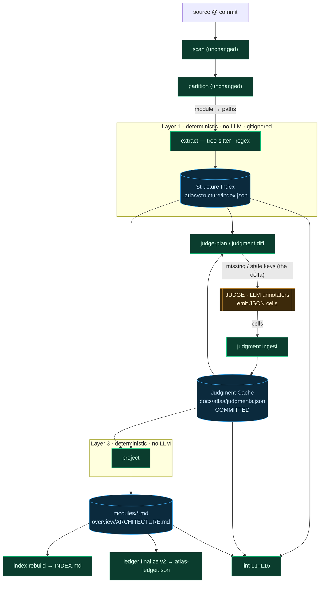
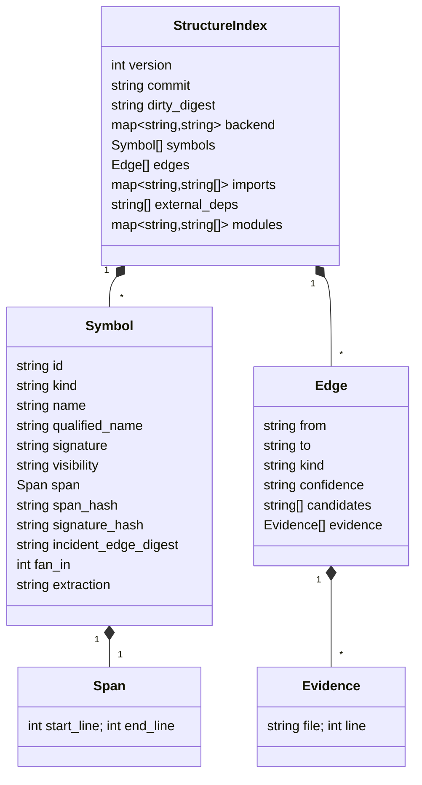

# Atlas v2 Design Record — the Projection architecture

**Status: PROPOSED (Wave 0 approval gate).** This document is the type-system proposal and
design record for atlas v2. It supersedes nothing until approved; v1 (`design.md`) remains
authoritative for the shipped plugin. Per the spec-first methodology, **no v2 code is written
until this record and its UML are approved.**

v2 keeps every v1 invariant that earns its place — committed markdown maps, the blob-SHA ledger,
deterministic partitioning, branch isolation, the always-loaded INDEX budget, T0–T3 staleness —
and changes exactly one thing: **who produces the doc.**

## The one-sentence change

> In v1 an LLM reads a module's source and **writes the whole doc**. In v2 a deterministic
> extractor produces the *structure*, an LLM produces only the *judgment* (cached, content-
> addressed), and a deterministic projector **assembles the doc** by joining the two — so the
> model is invoked only for the judgment delta, and a no-change rebuild touches no model at all.

## Why (the problem v2 solves)

A v1 full map of a medium repo costs ~4.7M tokens, split ~50% cartographer (reading source +
writing 7-section docs) and ~48% verifier (re-reading to refute claims). Everything else is
already deterministic, and unchanged docs already never reach an LLM (file-blob hash-gating,
v1 decisions 8 + "Why hash-gated regeneration"). The remaining LLM cost is concentrated in two
reducible places:

1. The model re-derives **structure** (Public API, External deps, the structural Relationship
   edges, symbol locations) that a parser can extract deterministically.
2. The verifier re-reads to check **structural** claims that, once the structure is ground truth,
   need no model at all.

v2 attacks both by splitting every doc into two provenances and caching the expensive one.

## Structure vs Judgment — the load-bearing distinction

| | Structure | Judgment |
|---|---|---|
| Examples | symbols, signatures, visibility, imports, call sites, type hierarchy, fan-in, `path:line` | Purpose, what's load-bearing & why, Gotchas, semantic edges (`owns/emits/reads/writes`), summary, read_when, architecture shape |
| Producer | deterministic extractor (tree-sitter \| regex) | LLM (cartographer-as-annotator) |
| Cost to recompute | ~free, every rebuild | one model call per content-version |
| Storage | gitignored, regenerable (`.atlas/structure/`) | **committed**, content-addressed (`docs/atlas/judgments.json`) |
| Verification | deterministic (`lint` joins doc ↔ index) | sampled LLM, verdict cached by the same key |

---

## Locked design decisions (v2) — extends `design.md` decisions 1–20

| # | Decision | Choice |
|---|----------|--------|
| 21 | Doc provenance | **Projection.** Committed docs are DERIVED by `project` joining the Structure Index with the Judgment Cache. The cartographer no longer writes markdown; it emits judgment cells. |
| 22 | Structure extraction | **Hybrid.** An external tree-sitter-backed helper (`subprocess`, mirrors `run_git`; probed via `$ATLAS_TS_HELPER` or `PATH`) emitting atlas's structure-JSON contract where available; the `cmd_ground` regex (`DEF_LINE_RE`/`IMPORT_LINE_RE`/fan-in) is the always-present fallback. Both feed one `resolve_edges` engine. Plugin is fully functional with **zero new deps**; the helper only raises edge precision (scope-resolved `to` targets). |
| 23 | Source untouched | Judgments live in a committed sidecar (`judgments.json`), **never** in source comments. The "atlas never mutates your source tree" invariant (v1 decision 11 discipline) is preserved absolutely. |
| 24 | Edge confidence | Every structural edge carries `resolved` \| `ambiguous` \| `unresolved`. A *unique* corpus-wide name (or a parser-supplied `to` target) is `resolved` — unambiguous, not a guess; a name with **multiple** candidates is never collapsed to one without parser evidence (kept `ambiguous`, all candidates listed); a name defined nowhere is `unresolved` and dropped. The LLM disambiguates only `ambiguous` edges feeding a doc being (re)projected. |
| 25 | Source of truth | The **Judgment Cache** (committed) is canonical for prose; the **Structure Index** (regenerable) is canonical for structure; docs + INDEX + ledger are all derived. Extends v1 "INDEX is derived" to the whole map. |
| 26 | Judgment keys | Content-addressed by **three orthogonal per-symbol hashes** — `signature_hash`, `span_hash`, `incident_edge_digest` — so each judgment kind invalidates on exactly the change that affects it (see "The judgment-key derivation"). A pure body edit is a zero-LLM re-projection. |
| 27 | Generator fingerprint | Bump to `cartographer/3` (the cartographer's output contract changes from markdown doc → JSON cells). Every v1 doc fingerprint-stales; `migrate-v1` re-keys existing prose so the bump costs no re-mapping. |
| 28 | Merge surface | The flat, content-addressed `judgments.json` is the merge surface: disjoint keys merge cleanly; a same-key re-judgment is a *real* semantic conflict surfaced to a human. Docs are regenerated-on-conflict (extends v1 decision 12 to `modules/*.md`). |
| 29 | Prose verification | **verify-set — delta-only, kind-scoped.** Structure is lint-verified for free; the judgment *prose* of the act-to-your-peril kinds (`symbol.contract`, `symbol.load_bearing`, `module.gotchas`) is adversarially sampled by `map-verifier` — automatically on map + update — with the verdict cached under the **same key** as the value, so an unchanged cell is never re-verified. A `fail` is re-judged once through the annotator with the verifier's `failures[]` as input, then re-verified; `verify-set` only ever stamps verdicts (JUDGE stays the sole cell producer). Soft prose (`purpose`/`summary`/`read_when`/`type_notes`/`overview.*`) is trusted — L16 pins its structural basis. Decided by a 3-member council, unanimous after a ranked runoff. |
| 30 | `edge.semantic` richness (v2.1) | The reserved `edge.semantic` cell kind is realized: one cell per **resolved cross-module structural edge**, keyed `H(from_span_hash + to_symbol_id)`, anchored to the calling symbol's module. The annotator judges whether a semantic verb (`owns`/`emits`/`reads`/`writes`) holds beyond the bare `calls`; the projector renders that verb in `## Relationships` (else the structural verb), and it rides the verify-set machinery as a falsifiable kind. The parser never emits semantic verbs, so cells piggyback on resolved edges, not a "semantic edge" iteration. Generator bumps to `cartographer/4` (cell contract + projection format changed — the decision-20 propagation path). |

### Why a projection (not a smarter cartographer)

The cartographer's judgment is the only irreducibly-LLM part of a doc; everything around it is
mechanically knowable. Asking the model to also emit structure means re-deriving (and re-verifying)
facts the repo already states unambiguously. Splitting provenance lets each half be produced by the
right tool and — critically — lets the expensive half be **cached by what it describes**, so it is
reused verbatim across every rebuild where that thing didn't change.

### Why verify the prose delta (and only the prose, only the delta)

Structure is now ground-truth: `lint` joins every doc claim to the Structure Index (L7) and to a
fresh projection (L16), so symbols, signatures, edges, and locations are deterministically checked
for free. That leaves exactly one hallucination surface — the *judgment prose* a parser cannot
write. v1's tenet holds: a confidently wrong `gotcha`/`contract`/`load_bearing` misleads every
future agent worse than no map. v1 paid ~48% of a map to guard it, but that cost was an artifact of
re-verifying the **whole** doc **every** run; v2's content-addressed verdict cache severs cost from
coverage. So v2 verifies the prose — but only the kinds a downstream agent acts on to its peril, and
only the **delta** (a cached `pass` under an unchanged key is skipped, so a no-change rebuild
verifies nothing). Soft routing prose (`purpose`/`summary`/`read_when`/`type_notes`/`overview.*`) is
trusted: it is rarely independently refutable and L16 already pins the structure it leans on. The
verdict is a first-class cell field (`verify.verdict ∈ {pass,fail,migrated,unverified}`); an
un-sampled or overflow cell is honestly `unverified`, never silently `pass`. (Decided by a
unanimous 3-member council weighing the quality bar against v2's cost thesis.)

### Why hybrid extraction, not full tree-sitter or pure regex

v1 chose language-agnostic regex (decision 3) for reach. Pure regex can't *resolve* a call graph, so
v1's model keeps deriving relationships. Full tree-sitter would abandon agnosticism and break the
stdlib-only invariant. Hybrid keeps the regex floor (any language, zero deps) and adds a parser
ceiling (precise scope resolution for the languages you use).

Both backends feed one shared resolution engine, `resolve_edges`, which assigns each call site a
confidence tier (decision 24). The regex backend extracts call sites by name and resolves them
**corpus-wide by name**: a uniquely-named callee is `resolved` (it is unambiguous, not a guess);
a name defined in several files is `ambiguous` (all candidates kept); a name defined nowhere in the
map is `unresolved` and dropped (it is an external/builtin call, already covered by `external_deps`).
The tree-sitter path does real scope resolution and emits a `to` target per call site, which
`resolve_edges` trusts directly — that is what collapses an otherwise corpus-ambiguous name to a
`resolved` edge.

atlas bundles no tree-sitter. The parser ceiling is an **external structure-extraction helper** — a
thin tree-sitter-backed binary emitting atlas's structure-JSON contract (symbols + scope-resolved
call sites). The extractor probes once via `$ATLAS_TS_HELPER` (explicit path) or an `atlas-ts-helper`
/ `tree-sitter` on `PATH`; on absence — or any helper failure — every file falls back to
`extract_regex`, stamping `backend: {<lang>: "regex"}`. An *explicit* `--backend treesitter` with no
helper still produces a valid index and sets `degraded: true`. **The degradation path is a tested,
first-class mode, not an error.**

### Why the structure index is gitignored but the judgment cache is committed

The Structure Index is a pure function of source at a commit — committing it would be like committing
build output, and it would conflict on every change. It lives in `.atlas/structure/`, keyed by
`commit + dirty-digest` exactly as `drift_cache_key` already fingerprints status. The Judgment Cache
is the accumulated, expensive-to-recreate model output — it MUST travel with the repo so a fresh
clone can re-project the map deterministically (and so a teammate without the plugin still gets the
prose). This is the v1 "frontmatter is the ledger source of truth" principle, relocated: the prose
source of truth moves from per-doc frontmatter into one content-addressed file.

### Why docs stay committed even though they are derived

Agents `@import docs/atlas/INDEX.md` and grep the rigid section anchors
(`grep -A20 "## Relationships" …`, v1 decision 15). Making docs ephemeral would break every consumer
and the always-loaded INDEX. So docs are committed but derived — like `INDEX.md` and
`atlas-ledger.json` already are in v1 — and a new lint check (L16) enforces `doc == fresh render`.

---

## Architecture — three layers + a projection



---

## Type system / schemas

### Structure Index — `.atlas/structure/index.json` (gitignored, rebuildable)



```jsonc
{
  "version": 1,
  "commit": "17e6ecc…",            // HEAD at extraction
  "dirty_digest": "sha256:…",      // git status bytes (à la drift_cache_key) — cache validity
  "backend": { "swift": "tree-sitter", "python": "tree-sitter", "*": "regex" },
  "symbols": [{
    "id": "src/auth/AuthService.swift::AuthService",  // path::qualified-name — survives line moves
    "kind": "class",
    "name": "AuthService",
    "qualified_name": "AuthService",
    "signature": "public final class AuthService",    // declaration line, whitespace-normalized
    "visibility": "public",                            // public | internal | private | unknown
    "span": { "start_line": 18, "end_line": 142 },
    "span_hash":      "sha256:…",   // H(span bytes)            — any edit incl. body
    "signature_hash": "sha256:…",   // H(normalized decl line)  — interface change only
    "incident_edge_digest": "sha256:…", // H(sorted incoming RESOLVED edges) — callers change
    "fan_in": 7,
    "extraction": "tree-sitter"     // tree-sitter | regex — per-symbol provenance / confidence
  }],
  "edges": [{
    "from": "src/auth/Session.swift::Session",
    "to":   "src/auth/AuthService.swift::AuthService",
    "kind": "calls",                 // calls | imports | extends | implements | conforms-to (STRUCTURAL only)
    "confidence": "resolved",        // resolved | ambiguous | unresolved
    "candidates": null,              // [symbol_id,…] when ambiguous
    "evidence": [{ "file": "src/auth/Session.swift", "line": 88 }]
  }],
  "imports": { "src/auth/AuthService.swift": ["Foundation", "KeychainAccess"] },
  "external_deps": ["Foundation", "KeychainAccess", "Combine"],
  "modules": { "src-auth": ["src/auth/AuthService.swift", "src/auth/Session.swift"] }
}
```

Determinism contract: identical input commit → byte-identical index. All arrays sorted (symbols by
`id`, edges by `(from, to, kind)`, imports keys sorted). This is what makes the judgment keys stable.

### Judgment Cache — `docs/atlas/judgments.json` (COMMITTED, canonical for prose)

```jsonc
{
  "version": 1,
  "judgments": {
    "<judgment_key>": {
      "kind": "symbol.contract",     // taxonomy below
      "value": "Owns session lifecycle; all login flows enter here",
      "provenance": {
        "model": "claude-sonnet-4-6",
        "generator": "cartographer/4",
        "created_at_commit": "abc1234"
      },
      "verify": { "verdict": "pass", "verifier": "map-verifier", "at_commit": "abc1234" }
    }
  }
}
```

`verdict ∈ { pass, fail, migrated, unverified }`. The verdict is cached under the **same key** as the
value — so re-verification, like re-judgment, collapses to the delta.

### Judgment taxonomy & keying — **the correctness crux**

The extractor emits three orthogonal hashes per symbol; each judgment kind keys on the one that
captures exactly its dependency. A key is `<kind>/<24-hex>` digesting the kind, an **identity anchor**
(the symbol id or module id — so two symbols with an identical signature never share one judgment),
and the trigger inputs below. The anchor decides *which* cell; the trigger decides *when it misses*.

| `kind` | Keyed on | Regenerates when… | Stable across… |
|---|---|---|---|
| `symbol.contract` | `signature_hash` + `visibility` | the interface changes | body edits |
| `symbol.load_bearing` (bool + why) | `signature_hash` + `incident_edge_digest` (resolved callers only) | interface OR resolved-caller-set changes | body edits, ambiguous-caller churn |
| `module.purpose` / `.type_notes` / `.gotchas` / `.summary` / `.read_when` | `public_surface_digest` | a public capability is added/removed/renamed | private-body edits, symbol reorder, signature tweaks |
| `edge.semantic` (`owns/emits/reads/writes`; also the disambiguation of an `ambiguous` structural edge) | `from_span_hash` + `to_symbol_id` + `kind` | the calling code changes | unrelated edits |
| `overview.shape` / `.dataflow` / `.index_facts` | `Σ module public_surface_digests` + inter-module edge digest | a module surface or cross-module edge changes | intra-module body edits |

where `public_surface_digest = H(unordered set of {name, kind, visibility} for public symbols
∪ unordered set of module-incident structural edge kinds)`. It keys on the public **capability set**
(names/kinds), NOT signature hashes: adding/removing/renaming a public symbol re-judges the module
prose, but merely tweaking an existing signature re-judges only that symbol's `symbol.contract` —
keeping the update delta tight (one cell, not the whole module + overview cascade).

**Why this exact keying (the failure modes it avoids).** A naive `H(span bytes)` key is wrong in
*both* directions:

- *Over-invalidation:* the most common edit is a body change with an unchanged signature (a bug
  fix). Under a span-hash key, `symbol.contract` and `module.purpose` would both miss and pay the
  LLM — even though neither the contract nor the purpose changed. The split keys make a pure body
  edit a **zero-LLM re-projection.**
- *Stale serve across the module boundary:* a symbol's "why it matters" legitimately depends on
  callers in *other* files. Keying on the symbol's own bytes alone would serve a stale
  `load_bearing` judgment when a new caller appears elsewhere. `incident_edge_digest` (incoming
  edges across the whole corpus) closes this.
- *Reorder churn:* an ordered surface digest churns when two functions swap position.
  `public_surface_digest` is an **unordered set** digest — reordering is a no-op.

**Thrash-resistance and graceful degradation.** `incident_edge_digest` includes only `resolved`
incoming edges — `ambiguous` edges (a common name like `get`/`run` defined in many files) are
recorded in the index for the LLM to disambiguate at projection but **excluded from the digest**, so
an unrelated same-named definition appearing elsewhere can never thrash a symbol's `load_bearing`
key; `unresolved` external calls are dropped entirely. In a pure-regex repo the digest still captures
high-confidence unique-name callers, while every ambiguous/uncalled symbol shares the empty-set
digest — so `load_bearing` degrades toward `signature_hash` alone exactly where resolution is weak,
no worse than v1's fan-in heuristic and never thrashing.

### Ledger v2 — extends `build_ledger` output (`bin/atlas-cli:531`)

```jsonc
{
  "version": 2,                      // was 1 — the bump triggers one-time migrate-v1
  "baseline": "17e6ecc…",
  "docs":          { /* unchanged v1 shape */ },
  "paths":         { /* unchanged v1 shape */ },
  "referenced_by": { /* unchanged v1 shape */ },
  "structure": {                     // NEW
    "index_commit": "17e6ecc…",
    "index_digest": "sha256:…",      // whole-index digest — cheap "did structure change at all"
    "symbols": {                     // path → per-symbol hashes (drives judgment diff w/o re-reading source)
      "src/auth/AuthService.swift": [
        { "id": "…::AuthService", "signature_hash": "…", "span_hash": "…", "incident_edge_digest": "…" }
      ]
    }
  },
  "judgment_keys": {                 // NEW — per-doc keys the projection consumed (v2 ripple analogue)
    "modules/src-auth.md": ["<key1>", "<key2>"]
  }
}
```

`judgment_keys` per doc lets `judgment diff` answer "doc X depends on keys K; K' changed ⇒ X
re-projects" deterministically — the v2 successor to `referenced_by` ripple. The v1 `docs/paths/
referenced_by` blocks remain intact for backward-compat and dirty-tree honesty (`dirty_paths`).

---

## Determinism boundary (honest)

tree-sitter yields a syntax tree and call *sites*, not cross-module name resolution. v2 never
pretends otherwise. Edge confidence is first-class:

- `resolved` — exactly one indexed definition matches the callee (and, where the grammar exposes a
  receiver type, the type matches). Emitted as fact.
- `ambiguous` — the name matches >1 indexed definition. **All** candidates emitted; the LLM picks
  the right one — but only for ambiguous edges feeding a doc actually being (re)projected.
- `unresolved` — the name matches 0 indexed definitions (external/dynamic). Name only, no target,
  excluded from `incident_edge_digest`.

Structural verbs (`calls/implements/extends/conforms-to`) can be parser-proposed; semantic verbs
(`owns/emits/reads/writes`) always require judgment — honoring the existing `ALLOWED_EDGE_VERBS`
split (`bin/atlas-cli:2017`). Building a real cross-module type resolver (LSP territory) is **out of
scope**; the confidence model exists precisely to avoid needing one.

---

## CLI surface — extends the `design.md` subcommand table

### New subcommands

| Subcommand | New functions | Phase |
|---|---|---|
| `extract [--module ID] [--backend auto\|treesitter\|regex]` | `cmd_extract`, `do_extract`, `extract_treesitter`, `extract_regex`, `compute_span_hash`, `build_edges`, `resolve_edges`, `load_or_build_index`, `structure_index_path` | v2-1/2 |
| `judge-plan` | `cmd_judge_plan`, `compute_judgment_keys`, `plan_judgment_misses` | v2-3 |
| `judgment diff` | `cmd_judgment_diff`, `judgment_key_delta` | v2-5 |
| `judgment prune` | `cmd_judgment_prune` (drops `diff`'s `orphaned_keys`) | v2-5 |
| `judgment ingest` (stdin payload) | `cmd_judgment_ingest` | v2-3 |
| `judgment verify-set` | `cmd_judgment_verify_set` | v2-6 |
| `project` | `cmd_project`, `render_module_doc`, `render_overview_doc`, `join_structure_and_judgments` | v2-4 |
| `migrate-v1` | `cmd_migrate_v1` | v2-8 |

`extract_regex` **lifts the existing `cmd_ground` body verbatim** (`DEF_LINE_RE`, `IMPORT_LINE_RE`,
fan-in) as the fallback backend — no behavior is reinvented. `judgment ingest` takes an opaque JSON
payload on stdin exactly as `cmd_verify_cache_write` (`bin/atlas-cli:1433`) does; the CLI recomputes
everything else.

### Modified subcommands (reuse, don't rewrite)

| Subcommand | Function (v1 line) | Change |
|---|---|---|
| `ground` | `cmd_ground` (1535) | Demoted to a thin shim over `do_extract` projecting the old `{files, imports, symbols}` shape so `test-ground.sh` stays green. Retired in Wave 7. |
| `ledger finalize` | `build_ledger` (531) / `cmd_ledger_finalize` (578) | Add `structure` + `judgment_keys` blocks, sorted-key & churn-free (unchanged structure → byte-identical ledger, preserving the `--refresh-hashes` property). |
| `ledger diff` | `compute_diff` (758) | Add a `version:2` path reporting `judgment_delta`; keep file-blob classification for dirty-tree honesty. |
| `lint` | `lint_map` (2045) | **L7 becomes a join** against the Structure Index (was a `WORDISH_BOUNDARY` grep, 2188). Add **L15** (no dangling judgment keys) and **L16** (`doc == fresh project render`, the projection analogue of L10's INDEX reconciliation, 2082). L1–L6, L8–L14 survive. |
| `index rebuild` | `cmd_index_rebuild` (1919) | The projector writes the `<!-- atlas:index-facts -->` block from the `overview.index_facts` cell; `build_index_text` (1867) is otherwise untouched. |
| `status` | `compute_status` (1264) | Tier fires on `judgment diff` misses; an L16 divergence is a tier-3 integrity failure (like the L10 INDEX check, 1295). |
| `scan` / `partition` | `do_scan` (2362) / `do_partition` (2580) | **Unchanged.** Partition's module→paths output feeds `extract`. Partitioning stays the deterministic, identity-stable front of the pipeline (v1 "out of scope: import-graph partitioning" still holds — extraction is a *separate* layer). |

---

## Protocol rewrites

### `/atlas map` (`references/mapping-protocol.md`)

```
0 preflight   status / lock acquire / scan / partition          (unchanged)
1 confirm     gate + branch ensure --op map                     (unchanged)
2 EXTRACT     extract → Structure Index                         NEW · deterministic
3 JUDGE-PLAN  judge-plan → every key missing on a fresh map     NEW
4 JUDGE       cartographer-as-ANNOTATOR fan-out (≤8 waves):     REWRITTEN
              each agent gets structure rows + the missing
              keys for its module, returns ONLY cells; pipe
              to `judgment ingest`
5 PROJECT     project → write modules/*.md + overview           NEW · deterministic
6 VERIFY      structural = lint (deterministic); judgment =     REWRITTEN
              map-verifier samples NEW cells; judgment
              verify-set caches verdicts by key
7 FINALIZE    ledger finalize (v2) ; index rebuild              (extended)
8 WIRE+COMMIT init ; commit --also CLAUDE.md --also .gitignore  (unchanged tail)
```

The cartographer's contract flips from "author the doc" to "annotate the structure": its input is
structure rows + a list of judgment keys to fill; its output is a **JSON array of cells, never
markdown** (the projector writes the file). `agent-overrides/cartographer-context.md` is rewritten
accordingly; generator → `cartographer/3` (v2.0), then `cartographer/4` once `edge.semantic`
cells join the contract (decision 30).

### `/atlas update` (`references/update-protocol.md`)

```
0–1 preflight + quarantine   unchanged
2  EXTRACT                   extract — rebuild index at current commit      NEW
3  DIFF-JUDGMENTS            judgment diff → only keys whose content        NEW (replaces stale/ripple plan)
                             address changed {new, signature, caller, removed}
4  JUDGE                     fan-out ONLY for missing keys (the delta)      REWRITTEN
5  PROJECT                   re-render affected docs; no-delta pull =       NEW
                             pure re-projection, ZERO LLM
6  VERIFY-DELTA              lint + map-verifier on changed cells only      REWRITTEN
7–9 finalize / commit / report   unchanged tail (extended ledger)
```

Report headline: **"N keys changed, M re-judged, K docs re-projected, P unchanged (byte-identical,
never reached an LLM)"** — the v2 successor to v1's `git show --stat` hash-gating proof, now at
*symbol* granularity.

`/atlas verify` and `/atlas repair` collapse: structural verification is deterministic `lint` (no
agents); only judgment cells need the verifier, verdicts cached by key. `map-repairer` edits *cells*
in `judgments.json`, then `project` re-renders — repair never hand-edits a committed doc again.

---

## Migration (v1 → v2) — mostly-deterministic prose re-key

`migrate-v1` upgrades an existing v1 map without a full re-map:

1. `extract` the repo at HEAD → Structure Index.
2. Parse each existing v1 doc with the **existing** `parse_symbol_tables` (`bin/atlas-cli:1995`) and
   `parse_relationship_edges` (2028).
3. For each parsed cell, match its symbol to the Structure Index by **name AND path**, compute the v2
   judgment key, and write the prose as that cell with `provenance.generator: "migrated/v1"`,
   `verify.verdict: "migrated"`. (Public-API contract → `symbol.contract`; Load-bearing "why" →
   `symbol.load_bearing`; Purpose/Gotchas → `module.*`; semantic edges → `edge.semantic`.)
4. `ledger finalize` (v2) → `project` → `lint`.

Cells whose symbol no longer matches (drift since the v1 map) are surfaced as `judge-plan` misses —
**only the unmappable remainder pays the LLM**, never a silent mis-attachment.

---

## Roadmap (v2 waves)

- [ ] **Wave 0** — This design record + UML (component dataflow + class/schema). **Approval gate.**
- [ ] **Wave 1** — `extract_regex` Structure Index core (regex only, zero new deps). `test-extract.sh`.
- [ ] **Wave 2** — tree-sitter backend behind a binary probe + tested regex fallback.
- [ ] **Wave 3** — Judgment Cache, the orthogonal-hash keys, `judge-plan`, `judgment ingest`. The four
      keying-invariant tests are the load-bearing correctness proof.
- [ ] **Wave 4** — `project` deterministic render (passes v1 lint L1 byte-for-byte; idempotent).
- [ ] **Wave 5** — Ledger v2 + `judgment diff`; the zero-LLM-on-no-change proof; double-extract determinism.
- [ ] **Wave 6** — lint v2 (L7-join, L15, L16) + status wiring.
- [ ] **Wave 7** — protocol rewrites + cartographer-as-annotator + e2e; retire the `ground` shim.
- [ ] **Wave 8** — `migrate-v1` + degradation hardening + README/design.md; `make test` before push.

Each wave is independently shippable, green before the next, tested by mock-free bash harnesses
(`tests/test-*.sh`) driving the real CLI in throwaway `/tmp` git repos — the v1 pattern.

## Out of scope for v2 (carried from v1, plus new)

Cross-module type resolution / a real semantic resolver (the confidence model replaces it);
LSP backends (heavy, stateful); import-graph-driven partitioning (still destabilizes doc identity);
per-symbol inline source comments (rejected — breaks source-untouched, can't hold non-local content,
degrades staleness detection); custom git merge driver; exact tokenizer integration.
